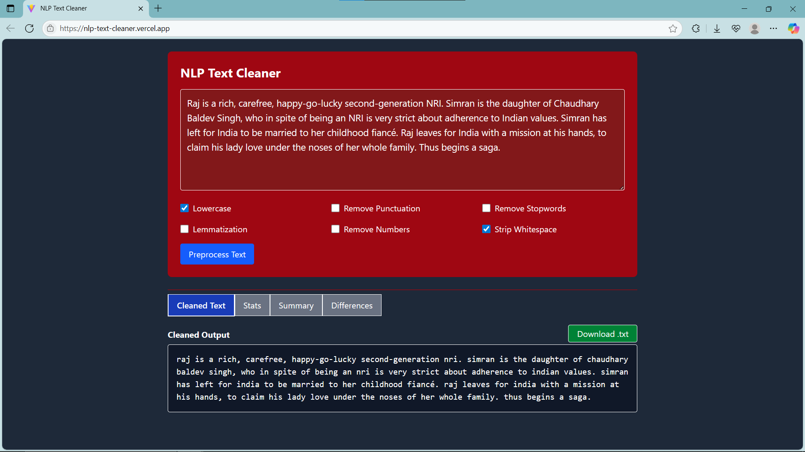
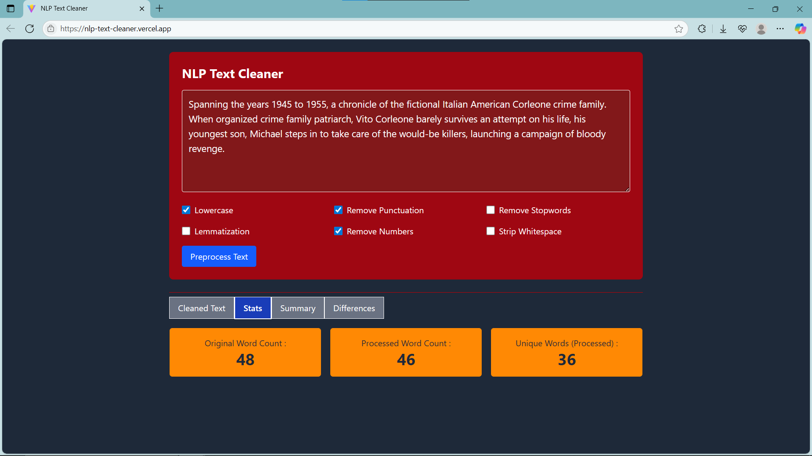

# NLP Text Cleaner (Frontend)

A lightweight and interactive web application for cleaning and preprocessing text. Users can customize preprocessing steps such as lowercasing, removing stopwords, punctuation removal, and lemmatization — all in real time.

## Features

- Paste and clean raw text
- Preprocessing options:
  - Lowercasing
  - Stopword removal
  - Lemmatization
  - Punctuation removal
- View original vs. cleaned text side by side
- Tabbed interface with:
  - Text comparison
  - Word/token statistics
  - Preprocessing summary
- Download cleaned text as a `.txt` file

## Technologies

- React with Vite
- Tailwind CSS
- Fetch API
- NLP Text Preprocessing (backend, deployed externally)

## Screenshots





## Getting Started

```bash
git clone https://github.com/ravi18kumar2021/nlp-text-cleaner.git
cd nlp-text-cleaner
npm install
npm run dev